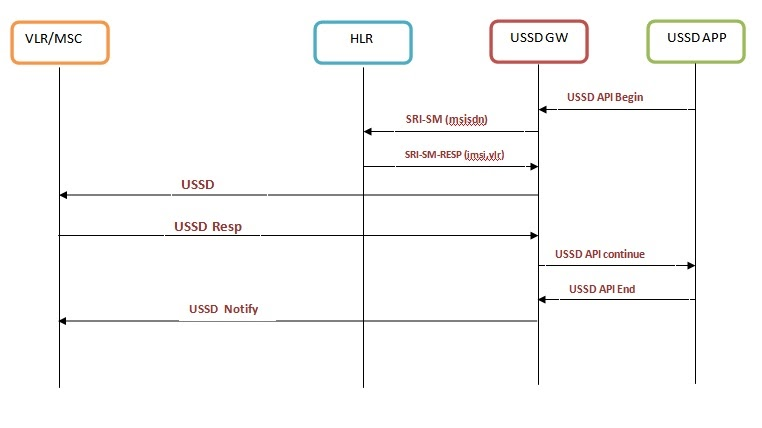
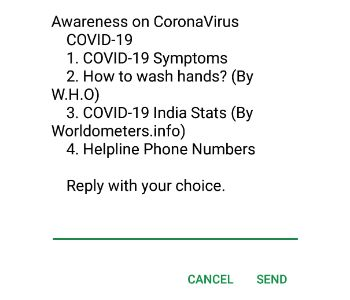
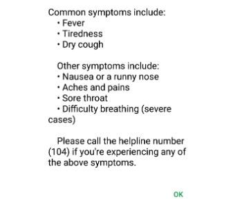
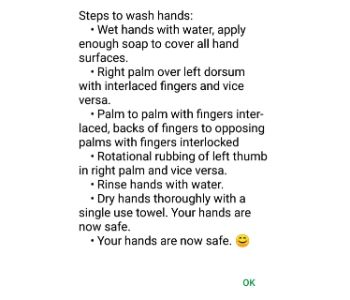
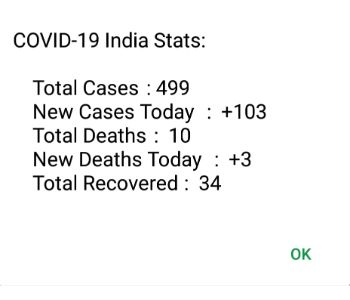
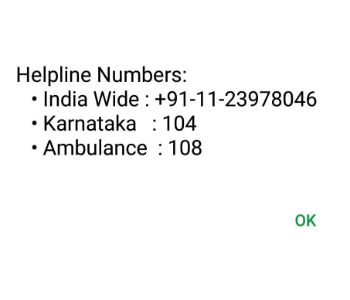

# A Simple USSD Application To Spread Awareness on CoVID-19 Throughout India

As the deadly, fear-striking Novel Coronavirus (CoVID-19) continues to spread rapidly throughout India, most of the people are not aware of the severity of the situation, and hence have to be constantly made aware about the seriousness of the spread, by keeping them up to date with information such as the daily statistics, helpline numbers, symptoms of CoVID-19, how to stay safe, etc. This application ensures last-mile access to information to people, even at locations where facilities like television, internet, media are not available. People in India with any kind of mobile phone (be it a smartphone, feature phone, or even basic phone), can avail this service.
<br></br>

## Introduction

USSD (Unstructured Supplementary Service Data) is a Global System for Mobile Communications (GSM) protocol that is used to send text messages. USSD is similar to the Short Message Service (SMS). USSD is used for a wide range of purposes such as prepaid callback service, location-based content service, WAP browsing, mobile banking services, mobile chatting, and more. You are using a USSD service when you dial a number that starts with * and ends with #.

1. Network Initiated USSD Call
<div></div>

<br></br>

## Implementation:


1. A Python Flask App, deployed on Heroku is used to scrape data from the table row from https://www.worldometers.info/coronavirus/  as an API.

2. HTTP GET to https://flask-pranu.herokuapp.com/ gives a CSV data of CoViD-19 cases in India

3. The USSD application is built on nodeJS, deployed on Heroku.

4. HTTP GET to https://peaceful-bastion-04035.herokuapp.com/ displays a default message.

4. CSV data is an array of objects Each object has properties such as
```totalCases```, ```newCases```, ```totalDeaths```, ```newDeaths```, and ```totalRecovered``` .

5. Info about Helpline Numbers, Symptoms of CoVID-19, and Steps to wash hands are sourced from W.H.O Official site https://www.who.int.


Features: Description of symptoms, steps to wash hands, daily statistics, helpline phone numbers, etc.
<br></br>

## Advantages:

1. Highly Scalable: This service can be deployed and installed on all major network carriers like Airtel, BSNL, Jio, Vodafone, etc.

2. Reachable to all sections of the society: This service can be availed on all kinds of mobile phones, be it a smartphone, feature phone, or even a basic phone. Also, this reaches every location where there is an absence of paper and visual media, the internet, or even electricity outage.

3. Further improvements like adding multiple language support, state-wise statistics based on the user’s mobile number, can be implemented.  
<br></br> 

## Screenshots: 

1. Landing Screen
<div></div>

2. First Screen: Symtopms
<div></div>

3. Second Screen: Steps to wash hands
<div></div>

4. Third Screen: Covid-19 live count
<div></div>

5. Fourth Screen: Helpline numbers
<div></div>

